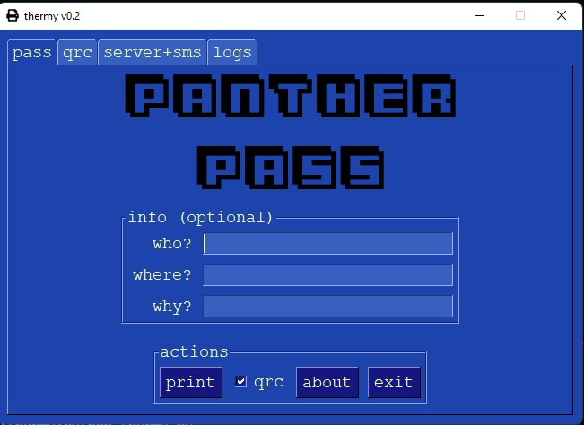

# thermy v0.2

Simple (ha!) thermal (esc/pos) printing for classrooms.  I made this for fun and to learn new stuff -- it works, so here it is! 

## Description

The current version:
* finds and connects to USB ESC/POS printers on Windows;
* prints hall passes (printing templates to be expanded, e.g. todo lists, random circle prompts, class currency, etc.);
    * includes optional QR codes on printed passes (generates QR code based on randomly chosen content from line in qrcontent.txt);
    * logs printing (pass) activity (saved to thermylogs.txt);
* includes GUI;
* can also be controlled via sms text message (twilio + ngrok + flask); and
    * at start, automatically updates sms twilio webhook url to current ngrok reverse proxy tunnel url.

## Getting Started

### What's required?

* ESC/POS USB Printer with libusb-k driver installed on Windows
    * See [python-esc-pos](https://python-escpos.readthedocs.io/en/latest/) for more info.
* For SMS control, twilio and ngrok accounts
* Python3

### Cloning and setting up your environment.
```
git clone https://github.com/FrozenBurrito/thermy.git
cd processage
python -m venv .
scripts\activate.bat 
pip install -r requirements.txt
```
### Modifying the python-esc-pos library to work with windows

* Follow the instructions [here](https://nyorikakar.medium.com/printing-with-python-and-epson-pos-printer-fbd17e127b6c) to modify the printer.py file in the python-esc-pos library to work on Windows.

### Installing Printer Driver (libusb-k)

* Replace the default ESC/POS printer driver with libusb-k.
* See [Zadig USB driver installation](https://zadig.akeo.ie/) (optional).

### Twilio Setup

* Purchase a new phone number on Twilio.  Create a messaging service in the Twilio dashboard (required for sending sms).  Choose option for on receipt of sms -> passthrough to defined webhook url.  Add new number to messaging service.
* Send and receive a test message within the Twilio dashboard to confirm your new number is working.

### Create and setup your .env file

* Create a .env file in your project root directory which defines the following environment variables:
```
TWILIO_ACCOUNT_SID=XXXXXXXXXX
TWILIO_AUTH_TOKEN=XXXXXXXXXX
TWILIO_PHONE_NUMBER=+15555555555
MESSAGING_SERVICE_SID=XXXXXXXXXX
NGROK_AUTH_TOKEN=XXXXXXXXXX
STUDENT_ORIGIN=YourName
```
### Customizing Logos, etc.

* Replace logotext.png with a custom logo.
    * logotext.png appears in main window and is printed at top of passes. 
* Replace print.ico with a custom icon.

### Customizing QR Codes

* Edit qrcontent.txt
    * Each line in qrcontent.txt holds content for new QR code.
    * Thermy randomly chooses 1 line (url or other content) from qrcontent.txt to converted into a QR code and print on each pass.
* To turn off QR codes, deselect qrc checkbox.
    * Check-box enables and disables QR code printing for desktop (window initiated) and SMS print requests. 

### Disabling SMS (Twilio + Ngrok + Flask)

* Comment out lines 164-168 and 174-176 (re starting ngrok), lines 233-236 (re starting flask as daemon thread), and 271-272 (re disconnecting ngrok).

### Running thermy
```
python thermy.py
```

### Bundling thermy as .exe with pyinstaller 
* First, update bundlethermy.spec with the correct paths to the binary and data files.
* Then, run:
```
python bundlethermy.spec
```
* This builds thermy.exe at dist/thermy.
* The qrcontent.txt and thermylogs.txt are at dist/thermy.

### SMS commands
```
pp name destination reason
```

---

## Help

Let me know if you have any questions or suggestions.

## Authors

Jon Morris, [frozenburrito](https://github.com/frozenburrito)

## Version History

* 0.2
    * Added sms control via twilio + flask + ngrok (for fun). 
    * Various fixes and additions.
* 0.1
    * It works!

## License

This project is licensed under the MIT License.  See the LICENSE.md file for details.

---

## Helpful Libraries

* [python-esc-pos](https://python-escpos.readthedocs.io/en/latest/)
* [flask](https://flask.palletsprojects.com/en/2.2.x/)
* [pyngrok](https://pyngrok.readthedocs.io/en/latest/index.html)
* [pysimplegui](https://pysimplegui.trinket.io/)
* [pyinstaller](https://pyinstaller.org/en/stable/)

## Helpful Sources

* [Changes required for python-esc-pos to work on Windows](https://nyorikakar.medium.com/printing-with-python-and-epson-pos-printer-fbd17e127b6c)
* ["Automating Ngrok in Python and Twilio Applications With Pyngrok"](https://www.twilio.com/blog/automating-ngrok-python-twilio-applications-pyngrok)
* [Zadig USB driver installation](https://zadig.akeo.ie/)
* [A Simple README.me template](https://gist.github.com/DomPizzie/7a5ff55ffa9081f2de27c315f5018afc)
